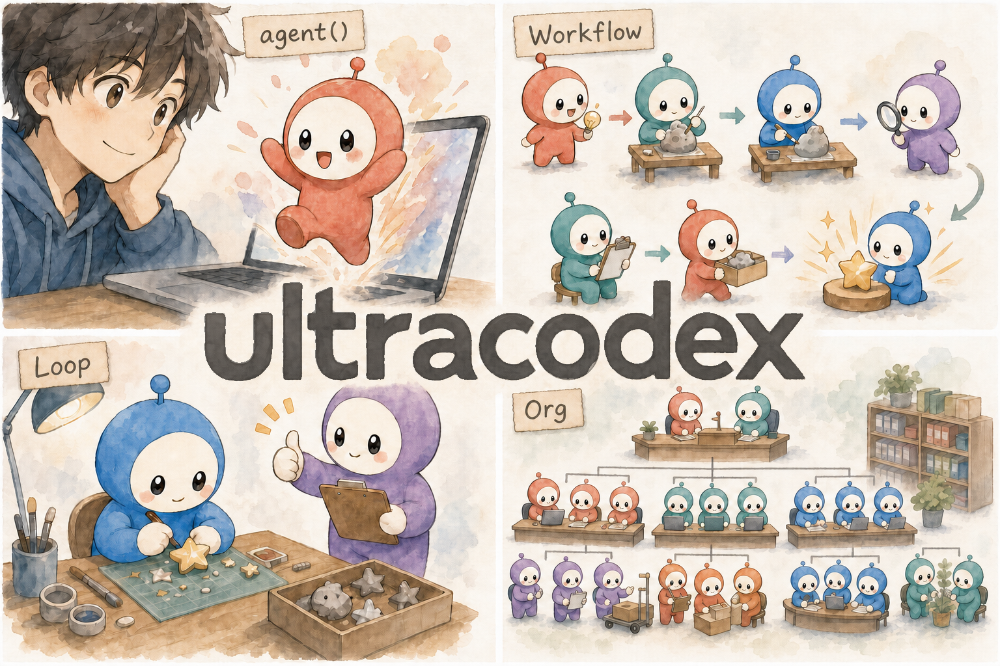
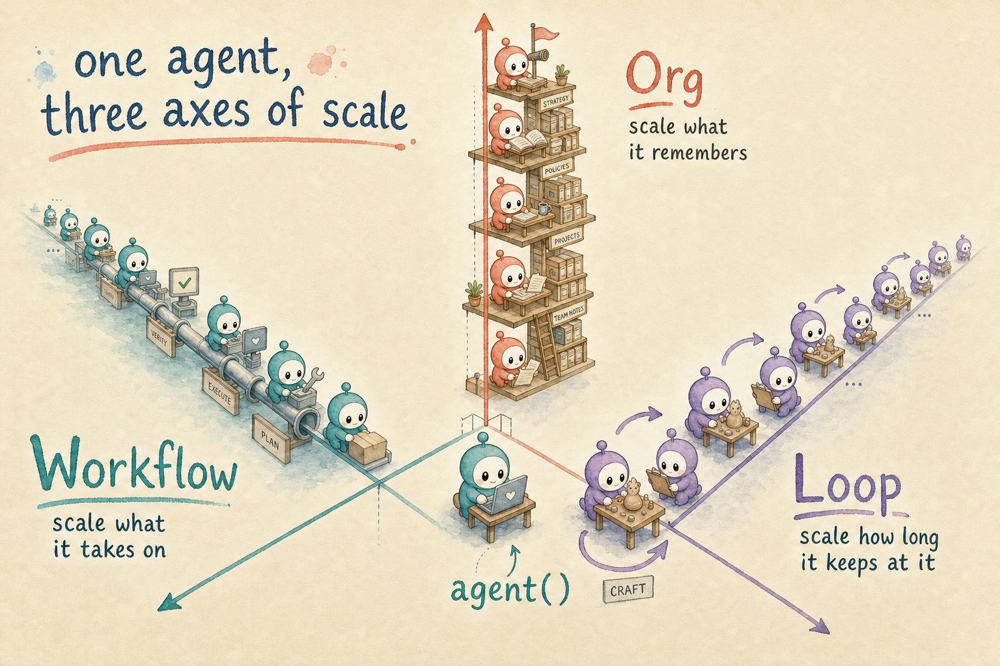
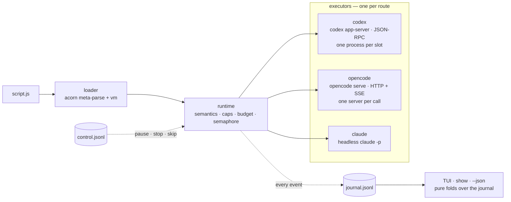

<p align="center">
  <a href="#workflows"><b>Workflow</b></a> 🌟
  <a href="#loops"><b>Loop</b></a> 🌟
  <a href="#scheduler"><b>Scheduler</b></a> 🌟
  <a href="#orgs"><b>Org (experimental)</b></a>
</p>

# ultracodex

[](https://github.com/YuanpingSong/ultracodex/actions/workflows/ci.yml)
[](https://www.npmjs.com/package/ultracodex)
[](LICENSE)

<p align="center">
  
  
</p>

**Run Claude Code workflow scripts, unmodified, on your Codex subscription — and on OpenCode.** Then go further than running them: **loop** them until a skeptical verifier approves, **schedule** them with cron doing the waking, or stand up a permanent **organization** of agents that remembers. Your Claude session writes the script and reads the verified result; the heavy lifting lands on the subscription you aren't rationing.

The idea underneath: the **agent is a unit of programming**. You write ordinary JavaScript and call an agent like a function — `await agent(prompt, { schema })` hands back a structured result. ultracodex abstracts the backend away, so one script runs on any of the three it supports: Codex, Claude, or OpenCode. Workflows, loops, schedules, and orgs are what you build once the agent is something you can program with.

Getting started is quick because your agent does the learning: a bundled skill teaches your coding agent how to drive ultracodex, so you describe the task and your agent writes and runs the workflow. One command installs it for Claude Code (`ultracodex sync-skills`); [docs/skills.md](docs/skills.md) covers codex, opencode, and any other agent. Given only that skill, a fresh agent ran all four pillars across Codex, Claude, and OpenCode ([the numbers](#status)).

## Quickstart

Prerequisites: Node ≥ 20, the [Codex CLI](https://github.com/openai/codex) installed and authenticated (`codex login`; tested against codex-cli 0.144.0), and — for the prompt-driven flow below — a driving agent, typically [Claude Code](https://claude.ai/code). No driving agent handy? Skip to [driving from the CLI](#driving-from-the-cli). [OpenCode](https://opencode.ai) is optional (tested against 1.17.18) — one `[route]` line turns it on.

```bash
npm install -g ultracodex      # or: pnpm add -g ultracodex
ultracodex doctor              # checks node, codex, auth, config — with actionable next steps
ultracodex sync-skills         # teaches Claude Code (and opencode) the whole contract
```

Then, in Claude Code, the prompt is just the task:

> Write a haiku that survives three rounds of adversarial critique. Run it with ultracodex.

Claude authors the workflow, the fleet executes on Codex (watch it live with `ultracodex ls` / `attach <runId>`, or bare `ultracodex` for the TUI), and the verified result lands back in your Claude session.

<a id="driving-from-the-cli"></a>
Driving from the CLI works the same way. `run` takes a path to any Agent Script you've written, or a packaged workflow by name — the two that ship in the box are `goal` and `loop`:

```bash
ultracodex run goal --budget 200k --args '{"task":"Write a limerick about cron jobs.","criteria":"5 lines, AABBA, mentions crontab, actually funny."}'
```

The example scripts live in the repo (`examples/`) once you've cloned it (see [From source](#from-source)); from a clone, `ultracodex run examples/actor-critic-loop/workflow.js --watch --budget 200k` runs one directly.

Run from **your project's root** — agents work in your cwd. `--json` blocks and prints the result (the machine path a driving LLM calls); `--watch` streams events; `--detach` prints the runId and exits; `--budget` takes output tokens (`500k`, `1m`). Runs are detached processes over plain files: quit the terminal, nothing dies.

## Workflows

**Workflows scale what agents can take on.** One script fans a task out to a fleet — parallel reviewers, pipelined stages, phased builds — and returns one verified result to whoever asked.

https://github.com/user-attachments/assets/4a7366cd-429c-4581-9703-7c28a9605c0e

*The workflow pillar, live. One prompt — "Write an essay on the meaning of life — actor–critic loop, 3 rounds. Run it with ultracodex." — Claude (left) authors the script, Codex executes it, the TUI (right) watches, and the result lands back in Claude. ([HD video](https://github.com/YuanpingSong/ultracodex/releases/download/v0.1.1/ultracodex-demo-v0.1.mp4))*

A script is an ES module: a pure-literal `meta` export, then a plain-JS async body over eight injected globals. No imports, no TypeScript.

```js
export const meta = {
  name: 'review-files',
  description: 'Fan out reviewers, verify findings, report',
  phases: [{ title: 'Review' }, { title: 'Verify' }],
}

const FILES = args?.files ?? ['src/auth.ts', 'src/api.ts']

phase('Review')
const findings = (await parallel(FILES.map(f => () =>
  agent(`Review ${f} for bugs. Return via the schema.`, {
    label: `review:${f}`,
    schema: { type: 'object', properties: { bugs: { type: 'array', items: { type: 'string' } } }, required: ['bugs'] },
  })
))).filter(Boolean)                    // failed agents are null, never throws

phase('Verify')
const verified = await pipeline(       // no barrier — each item flows independently
  findings.flatMap(f => f.bugs),
  (bug) => agent(`Try to refute: ${bug}`, { label: 'verify' }),
  (verdict, bug) => ({ bug, verdict }), // verdict may be null (failed verifier) — check it
)

return { verified: verified.filter(v => v && v.verdict) }
```

| global | what it does |
|---|---|
| `agent(prompt, opts?)` | run one agent; resolves final text, a schema-validated object, or `null` on failure (never rejects — except budget/caps, which throw) |
| `parallel(thunks)` | barrier over concurrent thunks; a thrown thunk becomes `null` |
| `pipeline(items, ...stages)` | per-item stage chains, no cross-item barrier; stages get `(prev, item, index)` |
| `phase(title)` | progress grouping for subsequent agents |
| `log(msg)` | narrator line in the TUI / `--watch` output |
| `args` | the run's `--args` input, verbatim |
| `budget` | `{ total, spent(), remaining() }` — output-token ceiling; exceeding it makes further `agent()` calls throw |
| `workflow(name, args?)` | run a saved workflow inline (one nesting level) |

`agent()` opts: `label` (display + routing), `phase`, `schema` (JSON Schema), `model` / `effort` (advisory tiers, mapped in config), `isolation: 'worktree'`, `agentType` (config profile, e.g. read-only explorer). `parallel()` is breadth, `pipeline()` is flow, and plain-JS `while`/`for` is depth. The full normative definition is [docs/agent-script-spec.md](docs/agent-script-spec.md); `ultracodex validate --strict` checks that a script stays in the portable subset that runs identically under Claude Code's Workflow tool and ultracodex.

Everything needed to author these — or to teach **any** model to author them — ships in the box: the [authoring skill](skills/agent-script-authoring/SKILL.md) (one self-contained document, hardened against three model families; GPT-5.5 given only this file authored scripts judged comparable-or-stronger than Claude-written references on 7/7 problems) and the [examples gallery](examples/) (nine orchestration shapes ordered as a complexity ladder, distilled from a census of 58 real production workflows). Installing the skills into Claude Code, codex, opencode, or a raw prompt: [docs/skills.md](docs/skills.md).

## Loops

**Loops scale how long agents keep at it.** The stop condition moves out of your code and into a judgment: keep going until a skeptical verifier approves, until discovery runs dry, until a scheduled run reports done.

```bash
ultracodex run goal --args '{
  "task": "Implement the CSV import endpoint",
  "criteria": "Build passes. Tests pass. Malformed rows are rejected with row-level errors."
}' --budget 250k
```

The builder works in rounds; a separate verifier checks every criterion against the work itself and rejects until it holds. The TUI folds the rounds into a trajectory — `✖ ✖ ✔ · converged after 3 rounds` — with per-round token cost, so convergence is something you watch. Loops are plain JavaScript `while`/`for` in any script; the packaged `goal` ships in the box (builds until approved — completion criteria like "the backlog is empty" work too); `budget` is the governor and pause/skip/stop work live. → [docs/loops.md](docs/loops.md)

## Scheduler

**The scheduler runs workflows on your clock.**

```bash
ultracodex schedule add digest --every 30m --budget 200k -- run digest.js
ultracodex schedule add nightly --daily 18:30 --until-done --budget 300k -- run goal --args '…'
```

`schedule add` writes one tagged crontab line and owns it completely; there is no daemon. `--until-done` retires a schedule the day its workflow returns `{ done: true }`. `--budget` caps every scheduled run — and scheduling a run without one gets a loud warning, because an unattended loop with no ceiling can drain a quota overnight. The Schedules tab shows exec-history strips, next-fire countdowns, and a run-now key. → [docs/schedule.md](docs/schedule.md)

## Orgs

**Orgs scale what agents remember.** This pillar ships as **experimental** — the runtime is tested and the acceptance org is real, but the discipline is young; supervise early cycles.

One analyst can't cover five hundred stocks. A research desk can: one analyst per name, each keeping their own notes, each writing a one-page brief their lead actually reads. An org is that desk, built from agents.

An org is a directory tree. Each agent is a directory — a role contract, its own memory files, an inbox — and a tick wakes the agents whose triggers fire (time, inbox depth, severity, dependency). Every wake runs from inside the agent's own directory, so the sandbox enforces who writes what. Memory compounds between wakes, and each level distills upward into a brief of at most 80 lines for the level above. Cross-model audits verify cited claims against their sources line by line; replay re-lives ingested history with fault injection so thresholds get tuned on evidence.

This repo ships a live example: an org watching ultracodex's own dependency tree — one seat per package, group leads for runtime and toolchain, one root brief for the maintainer.

```bash
ultracodex org init      # scaffold the agent tree from coverage.toml
ultracodex org tick      # wake whoever is due, deliver messages, lint
```

The shipped org-creation skill designs the whole structure with you — coverage, role templates, fetchers, audit cadence. → [docs/org.md](docs/org.md)

## Configuration & routing

**Zero config required** — the values below are the shipped defaults (`ultracodex doctor` prints the resolved profile). Create `.ultracodex/config.toml` (project) or `~/.ultracodex/config.toml` (global) only to override:

```toml
[route]                        # first match wins: label, then phase
"*"          = "codex"         # default: everything runs on Codex
# "impl:*"   = "opencode"      # mixed routing: implementation on OpenCode…
# "review:*" = "claude"        # …adversarial review on a third vendor

[backends.codex]
sandbox        = "workspace-write"
default_model  = "gpt-5.6-sol"
default_effort = "xhigh"

[backends.opencode]
model = "deepseek/deepseek-chat"   # any provider/model your opencode knows
```

Routing lives in config, and that is what keeps scripts portable across runtimes and backends. Full reference (backends, model maps, sandbox/network escalation ladder, concurrency): [docs/operations.md](docs/operations.md).

## CLI

```
ultracodex                        TUI home: Runs | Loops | Schedules | Org
ultracodex run <script|name>      [--args JSON] [--budget 500k] [--watch|--json|--detach] [--strict]
ultracodex ls | show <ref> | attach <ref>       inspect runs (ref = unique runId prefix)
ultracodex pause|resume|skip|kill <ref>         live controls
ultracodex logs <ref> [n]         raw runner / per-agent event logs
ultracodex validate <script>      dual-runnability lint (--strict = portable subset)
ultracodex schedule add|ls|pause|resume|rm      recurring runs via owned crontab lines
ultracodex org init|tick|status|send|ask|audit|replay|lint   the org runtime (experimental)
ultracodex sync-skills            static + per-workflow skills → .claude/skills/
ultracodex doctor                 env, auth, execution profile, schedules, interactive-config divergences
```

Every run directory (`.ultracodex/runs/<runId>/`) is plain files — journal, per-agent events, `result.json` — and any agent's Codex session can be resumed interactively (`codex resume <threadId>`, surfaced in the TUI).

<a id="from-source"></a>
### From source

```bash
git clone https://github.com/YuanpingSong/ultracodex && cd ultracodex
pnpm install && pnpm build && pnpm link --global
```

The clone includes the [examples gallery](examples/) — nine orchestration shapes as a complexity ladder, each a validated reference script.

## How it works

A script is parsed once, then the runtime drives each `agent()` call through the backend its `[route]` selects — journaling every event, so the TUI, `show`, and `--json` are all pure reads of the same log:



The agent is the unit of programming here: `agent()` is a call with a typed, validated return, Agent Script is the format, and the [Executor Contract](docs/executor-contract.md) is what keeps the unit portable — a capability descriptor plus a 10-assertion conformance kit that all three adapters pass. Structured output is belt-and-suspenders: schemas ride the wire where the backend supports it (Codex strict mode, OpenCode `json_schema`), degrade to a prompt contract mid-call when a provider rejects them, and are always enforced engine-side (ajv validation + repair turns on the same session). The entire test suite runs hermetically against scripted fakes of all three harnesses — no API keys in CI.

Deeper reading: [docs/loops.md](docs/loops.md) · [docs/schedule.md](docs/schedule.md) · [docs/org.md](docs/org.md) · [docs/architecture.md](docs/architecture.md) · [docs/operations.md](docs/operations.md) · [docs/skills.md](docs/skills.md) · [docs/agent-script-spec.md](docs/agent-script-spec.md) · [docs/executor-contract.md](docs/executor-contract.md) (write your own backend).

## Sandboxing & trust

Agents ship with safe defaults, and how strongly those defaults are *enforced* depends on the backend. Codex is the only one with an OS-level sandbox; Claude and OpenCode fall back to capability limits, which is why the three sit on a ladder.

- **Codex** — an OS sandbox (macOS Seatbelt) enforces confinement below the agent. The default is `workspace-write` with **no network and approvals auto-denied**: writes stay in the project, reads are unrestricted, no egress. This holds even against a prompt-injected agent, because the boundary is the kernel rather than the model. Escalate deliberately in config (`network_access`, then `danger-full-access`) — each step is opt-in and warned.
- **Claude** — no OS sandbox, so containment moves up to the tool allowlist. The default (`--allowedTools Read Glob Grep`) hands the agent read-only tools, so a Claude-routed agent can only read out of the box. Widen the allowlist to let it write or run shell, and it runs as your user with no OS confinement.
- **OpenCode** — no OS sandbox and no approval gate: headless execution runs tools including shell, has network, and inherits the MCP servers from your opencode config. Treat every OpenCode route as running as yourself.

The rule that follows: route work you'd be comfortable running yourself to Claude or OpenCode, and keep untrusted-content ingestion — fetched docs, third-party repos — on Codex's sandbox. `ultracodex doctor` prints each backend's real posture, and the engine journals a warning whenever a script requests a sandbox tier a backend cannot honor, so the gap between what a script asks for and what a backend enforces is always visible. Full escalation ladder and the exfiltration note: [docs/operations.md](docs/operations.md).

## Limitations

- **Orgs are experimental.** The runtime is tested and the dependency-watching example org is real, but this is the newest pillar and its discipline is young — interfaces and defaults may change, and early cycles want supervision — do not schedule them unattended yet.
- **OpenCode has no OS sandbox** (see above), and its server-per-call design can collide under heavy concurrency; keep concurrent OpenCode agent counts modest. Codex and Claude are the load-bearing backends.
- **The OS sandbox is validated on macOS.** Confinement rests on macOS Seatbelt, and the nested-fleet auto-downgrade keys off codex's Seatbelt marker; on Linux, codex sandboxes differently, so live sandbox behavior there is unverified. The hermetic test suite runs everywhere.
- **Pre-1.0, pinned to a moving target.** The codex app-server protocol is experimental and version-pinned (codex-cli 0.144.0, opencode 1.17.18); `ultracodex doctor` flags drift, but a newer backend can shift behavior under you.

## Status

Current release: **v0.5.0** — workflows, loops, the scheduler, and orgs, in one package. 600 hermetic tests; pinned against codex-cli 0.144.0 (gpt-5.6) and opencode 1.17.18; `ultracodex doctor` reports drift with next steps.

The project builds itself:

- The fleets that built v0.5.0: 14 runs, 72 agents, 1.26M output tokens — all on Codex, with the driving Claude session doing planning and review ([per-run ledger](docs/internal/research/v050-fleet-usage.md)).
- This project was built twice — once by Claude fleets on the Workflow tool, once as a clean-room rebuild by Codex fleets through ultracodex, independently verified at 125/125 tests ([the record](docs/internal/acceptance-comparison.md)).
- A controlled comparison, one `[route]` line apart: the same build script shipped the same module at 12/12 tests on every model tried — Codex (gpt-5.6-sol) in 107 s with zero Claude quota; Claude Opus 4.8 in 219 s, sonnet-5 in 237 s, and a deliberately-overkill Fable 5 in 246 s, all on the Claude meter. Capability beyond the task simply runs a pricier meter — which is why routing is a config line ([methodology and raw journals](docs/internal/research/cmp-build/README.md)).
- Any vendor drives it: given only the installed skill, a stranger’s agent chose and ran the right pillar — workflow, loop, scheduler, or org — with dispatch correct on every run. Across 15 tasks per backend: Claude (sonnet-5) 14/15, OpenCode (GLM-5.2) 14/15, Codex (gpt-5.6-terra) 10/15. The misses were model quality (a weakly-worded verifier) or infrastructure (server-spawn contention under concurrency), never a wrong pillar or a broken command ([the campaign, with every judgment](docs/internal/research/skill-validation/README.md)).
- One three-vendor run shipped a real feature on this repo: OpenCode implemented it, Codex gated it, Claude adversarially reviewed it — one journal.
- The org runtime's acceptance test ran here too: the dependency-watching org above completed its first full live cycle on the shipped runtime, briefs and audits included.

## License

[Apache-2.0](LICENSE). The app-server turn state machine adapts patterns from OpenAI's Codex plugin for Claude Code (Apache-2.0) — see [NOTICE](NOTICE).
