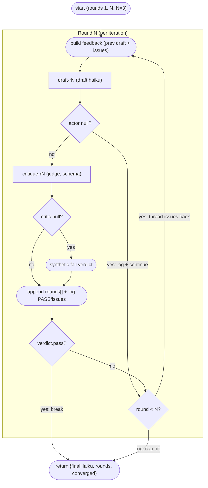

# Actor-critic convergence loop with early exit

**Shape:** actor–critic convergence loop — bounded rounds, structured verdict as the loop condition, early exit on first pass

## Problem

I need a haiku on the meaning of life, and it has to clear a strict rubric: exactly 5-7-5
syllables, vivid imagery, and no clichés. All three at once — a poem that nails the syllable
count but leans on "journey" and "candle flame" is a fail.

The operational constraints:

- **One shot almost never lands.** Generation reliably satisfies one or two criteria per
  attempt but rarely all three, so the process has to survive rejected drafts and improve on
  them rather than just retrying blind.
- **Self-grading is worthless.** Whatever produces the draft cannot be the thing that
  approves it — generators grade their own output leniently. I need an independent,
  adversarial pass/fail judgment, and it must come back machine-readable: a hard boolean
  plus a concrete list of issues I can act on, not prose vibes.
- **The judge must not invent requirements.** The rubric is exactly those three criteria;
  a grader that starts demanding seasonal references or specific imagery creates false
  failures and burns budget.
- **Budget is tight and this runs unattended.** Every attempt costs real tokens. The run
  must stop the moment an attempt passes, and it must give up cleanly after a small hard
  cap of attempts instead of retrying forever.
- **Either step can fail transiently.** A failed generation or an unavailable judge must
  cost at most that one attempt — never crash the run or hang it.
- **I need the receipts.** The final output should include not just the winning haiku but
  the full history of attempts and verdicts, and an explicit flag saying whether the rubric
  was actually satisfied or the cap was hit.

## Topology

The diagram traces one iteration of the bounded `for` loop as the script actually runs it: the feedback block, the two agent dispatches with their independent null-guards, the audit append, and the two decisions that end the round — a passing verdict (early exit) or the round cap. The labeled back-edge is the loop; note that a failed actor forfeits its round through the same cap rather than earning a retry.



## Reference solution

The shape is a **script-level convergence loop**: a bounded `for` loop in which each round
re-dispatches two fresh agents — an *actor* that drafts and a *critic* that judges — with
the critic's structured verdict serving as the loop condition. It fits because the problem
is depth, not breadth: nothing here fans out; quality is reached by iterating draft →
judgment → targeted revision, and the constraints (hard cap, stop-on-pass, independent
judging, audit trail) map one-to-one onto loop bound, `break`, a second agent role, and an
accumulator.

Why this example exists: in a census of dozens of real orchestration scripts, this was the
rarest shape of all. Every loop found in the wild was one of two weaker forms — fixed-rounds wave
chunking (run N waves unconditionally, no convergence test) or an until-green loop
delegated *inside a single agent's prompt* ("keep fixing until the tests pass"), where the
script never sees intermediate verdicts and can neither cap, audit, nor route the judge
independently. A true script-level convergence loop — where the *script* re-dispatches
agents each round and an independent critic's `{ pass, issues }` verdict decides whether to
continue — appeared nowhere. That loop, including the early-exit guard that makes the round
cap a worst case rather than a fixed cost, is exactly what this example teaches.

Loops are ordinary JavaScript, which means their guardrails are yours to install — there are three safety rails every convergence loop needs, and this script wires up two of them directly while the third is a one-line habit the topology invites. **Rail 1: null-check every agent result** — a failed or skipped `agent()` resolves `null`, it never throws, so both the actor and the critic get an explicit null branch (below). **Rail 2: cap rounds explicitly** — the `for` bound is the plan; the runtime's lifetime agent cap is a backstop, not a design. **Rail 3: guard unbounded loops on budget** — `budget.remaining()` is `Infinity` when the run starts without `--budget`, so a loop that could otherwise spin should break when the remaining ceiling drops below one more round's worth of tokens (e.g. `if (budget.total && budget.remaining() < 20_000) break`). This example fixes its round count at three, so the budget governor is implicit rather than coded; the moment the cap becomes a variable or an `--args` input, add the break.

Walkthrough of the topology:

1. **`meta.phases` declares `Round 1`–`Round 3`** and the loop calls
   `phase(\`Round ${round}\`)` at the top of each iteration, so progress groups by round.
2. **Feedback threading.** Before dispatching the actor, the loop builds a feedback block
   from the previous round's state: the rejected draft plus the critic's issues, joined
   into the new prompt with an explicit "Fix every issue." First round, the block is empty.
3. **Actor call** (`draft-rN`) drafts against rubric + feedback. A `null` result
   (failed/skipped agent) is logged and forfeits the round via `continue` — the cap still
   counts it, so a flaky actor cannot extend the run.
4. **Critic call** (`critique-rN`) judges with the `CRITIQUE` schema —
   `{ pass: boolean, issues: string[] }`, both required — and is explicitly told not to
   invent requirements beyond the rubric. A `null` critic degrades to a synthetic failing
   verdict (`{ pass: false, issues: ['critic unavailable'] }`) so control flow never
   dereferences null and an unavailable judge can never accidentally approve a draft.
5. **Audit + narration.** Every round appends `{ round, haiku, pass, issues }` to `rounds`
   and `log()`s either `PASS` or the issue count — no silent outcomes.
6. **Early exit.** `if (verdict.pass) break` — the loop bound is a ceiling, not a cost.
7. **Return value** is `{ finalHaiku, rounds, converged }`: the artifact, the full history,
   and an honest flag distinguishing "critic passed it" from "ran out of rounds".

## Techniques

- **Script-level convergence loop** — a bounded `for` loop re-dispatching fresh actor and
  critic agents each round, with the critic's verdict as the loop condition (vs. delegating
  "loop until good" into one agent's prompt).
- **Early-exit guard** — `break` on the first passing verdict; the round cap is a worst
  case, not a fixed spend.
- **Schema-constrained critic** — schema const in CAPS, `{ pass, issues }` with both
  required, so the verdict is machine-checkable and the issues are actionable.
- **Anti-scope-creep judging (verifier calibration)** — the critic prompt pins the rubric
  and forbids inventing requirements beyond it. This is calibration, not politeness: anchor
  the judge to the *stated* requirements or an adversarial verifier invents a fresh
  requirement every round, manufactures false failures, and the loop never converges (ask
  us how we know). The judge must be adversarial about the *listed* criteria and only those.
- **Feedback threading** — the rejected draft and the critic's concrete issues are injected
  into the next actor prompt.
- **Null-tolerant rounds (rail 1)** — actor `null` → log + `continue` (round forfeited under
  the cap); critic `null` → degrade to a synthetic failing verdict, never a false pass.
- **Explicit round cap (rail 2)** and **budget governor (rail 3)** — the `for` bound is the
  real ceiling (the lifetime agent cap is a backstop), and a budget-aware `break` keeps an
  unbounded round count from spinning past its token ceiling.
- **Role-labeled agent calls** — `draft-rN` / `critique-rN`, enabling label-based
  backend routing with no script change. For genuinely independent judgment, route the judge
  to another backend: add `"critique-r*" = "claude"` under `[route]` in
  `.ultracodex/config.toml` and the actor and critic come from different model families —
  the loop is byte-for-byte identical; only the routing table changes.
- **Per-round `phase()`** matching `meta.phases` titles for progress grouping.
- **No-silent-outcomes `log()` narration** — every round reports PASS or its issue count.
- **Audit-trail return** — full `rounds` history plus an explicit `converged` flag.

## Run it

```
ultracodex run examples/actor-critic-loop/workflow.js --watch --budget 200k
```

It runs as-is — no user data required. The task (haiku on the meaning of life, judged 5-7-5 / vivid / no clichés) is baked into the script, so you can execute it verbatim; `--watch` streams each round's actor and critic events, and `--budget 200k` caps output tokens. To judge with an independent backend, add `"critique-r*" = "claude"` under `[route]` in `.ultracodex/config.toml` before running — no code change.

Cost: two agents per round (one actor, one critic) times at most three rounds, so six lightweight agents worst case, fewer with an early exit. Small prompts by design — a cheap run.
