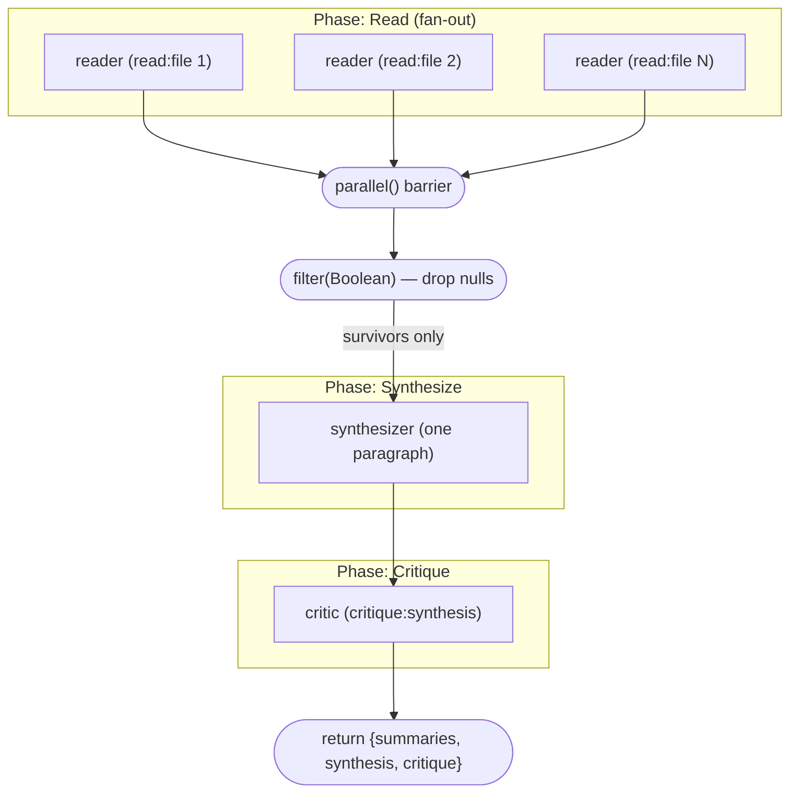

# Fan out over sources, synthesize one artifact, verify it against them

**Shape:** parallel fan-out → single synthesis → adversarial critique against the original sources

## Problem

I have a body of source material split across several documents — for a running project, that's typically the README, an architecture doc, and an operations runbook, but the shape is the same for any set of files that each cover one slice of a larger whole. No single document is the full picture; each is a partial view. I want one short, coherent summary — a "state of the project" paragraph — that reflects all of them together.

The constraints that make this more than a concatenation:

- **No one document holds the whole story, and reading them serially is wasteful.** The sources are independent and each takes real reading; there is no ordering dependency between them, and I don't want the total latency to be the sum of reading each one in turn.
- **The final artifact is one paragraph, not a pile of summaries.** I need the partial views actually fused into a single coherent statement, not stapled together or bullet-listed.
- **A synthesis is exactly where hallucination hides.** When one agent compresses several inputs into fluent prose, it tends to smooth over gaps and assert things the sources never said. So the summary cannot be trusted as written — it has to be checked, claim by claim, against the actual source documents, and any statement the sources don't support has to be flagged.
- **The writer cannot be its own fact-checker.** Whatever produced the paragraph will wave its own claims through. The check has to be an independent pass that re-reads the sources from scratch, and it must come back machine-readable — a hard "accurate or not" boolean plus a concrete list of unsupported claims — not a vibes paragraph.
- **One missing source must not sink the run.** If reading one document fails, I still want the synthesis built from the others, told plainly which source dropped out — not a crashed run and not a summary silently missing a third of its inputs.



The three readers fan out as "xN" — one per source file — over the barrier; the diagram shows three representative parallel nodes, not one per literal file.

## Reference solution

The shape is a three-stage funnel: **wide, then one, then adversarial**. Breadth is bought up front with a parallel fan-out over the sources; the partial views are fused by a single synthesizer; and the fused artifact is checked by an independent critic that re-reads the originals. There is no loop and no early exit — each stage runs exactly once — because the job is "gather → fuse → verify," not "iterate to convergence."

Walkthrough of the topology:

1. **`meta.phases` declares `Read` → `Synthesize` → `Critique`**, and the body calls `phase(...)` at each transition, so progress groups by stage in the TUI.
2. **Read (fan-out).** `parallel(FILES.map(f => () => agent(...)))` launches one reader per source file at once. `parallel()` is a **barrier**: it resolves only when all thunks have settled, and a failed reader yields `null` in the results array rather than rejecting the whole batch. Each reader returns through the `SUMMARY` schema (`{ file, summary }`, both required, summary pinned to 1–2 sentences), so the survivors come back as validated objects, not free text. The readers carry a `read:<file>` label — that label shows in the TUI and is also what backend-routing rules match against.
3. **`.filter(Boolean)` between phases.** The array from the barrier is filtered in plain JavaScript to drop the `null`s from any failed reader. This is the null-tolerance mechanism: one dropped source costs one summary, never the run. A `log()` line narrates `got N/M summaries` so a shrunken input set is loud, not silent.
4. **Synthesize.** A single agent receives the surviving summaries — each formatted as `- <file>: <summary>` — and fuses them into one "state of the project" paragraph. This is the only stage with no schema: the artifact is a paragraph, and prose is what's wanted.
5. **Critique (adversarial).** A single critic is told to **re-read the source files itself** and check the synthesis against them, flagging any claim the sources don't support. It returns through a schema — `{ accurate: boolean, issues: string[] }`, both required — so the verdict is machine-checkable and the issues are actionable rather than narrative. The critic re-reading from scratch, rather than trusting the summaries or the paragraph, is what makes the check independent.
6. **Return** is `{ summaries, synthesis, critique }`: the partial views, the fused artifact, and the structured verdict, together — the full audit trail, not just the paragraph.

**The cross-vendor routing note.** The critic's label is `critique:synthesis`, and the script's comments call out why: point a `"critique:*" = "claude"` rule at that label in `.ultracodex/config.toml` and the writer and the judge run on **different backends** — one vendor writes the synthesis, another vendor judges it against the sources. That is cross-vendor verification with no change to the script: the label already exists, so routing is a config edit, not a code edit. It's the strongest form of "the writer can't grade its own work," since even the model family differs between the two roles.

## Techniques

- **Barrier fan-out** — `parallel(FILES.map(f => () => agent(...)))` reads every source at once and resolves only when all readers settle; a failed reader yields `null`, never a rejection.
- **`.filter(Boolean)` degradation between phases** — nulls from failed readers are dropped in plain JS, so one lost source costs one summary rather than the run.
- **Schema-constrained readers** — `SUMMARY` const (`{ file, summary }`, both required, length pinned in the description) makes each partial view a validated object.
- **Single-synthesizer fuse** — one agent, no schema, turns the surviving summaries into one coherent paragraph; prose is the intended artifact here.
- **Independent adversarial critique** — a separate agent re-reads the sources from scratch and checks the paragraph against them, rather than grading its own output or trusting the summaries.
- **Schema'd verdict** — `{ accurate: boolean, issues: string[] }`, both required, so the check is machine-checkable and the flagged claims are actionable.
- **Label-based backend routing** — `read:<file>` and `critique:synthesis` labels enable cross-vendor verification (writer on one backend, judge on another) via a config rule, with no script change.
- **No-silent-drops `log()` narration** — `got N/M summaries` makes a shrunken input set visible.
- **Full audit-trail return** — `{ summaries, synthesis, critique }`, not just the final paragraph.

## Run it

```bash
ultracodex run examples/fanout-synthesize/workflow.js --watch
```

Runs as-is with no setup: the sources are this repo's own docs (`README.md`, `docs/ARCHITECTURE.md`, `docs/OPERATIONS.md`), so the workflow reads real files the moment you clone. Point it at your own document set by editing the `FILES` array. Cost is about five agents — three readers, one synthesizer, one critic — all short, single-turn calls.
