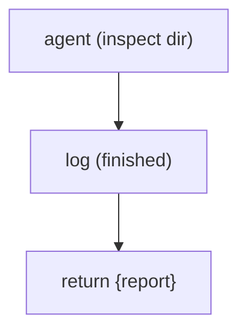

# Hello: one agent, one result

**Shape:** single agent — one dispatch, one return value

## Problem

Before you build anything with fan-out, gates, or convergence loops, you need to know the toolchain works end to end: that a script can dispatch one coding agent into your project, get its final message back, and surface that as the run result. This is the smoke test — the "does the wiring conduct" check you run first, on a fresh install or a new machine, before trusting any larger workflow.

The one thing worth doing correctly even here: an agent can fail. A single dispatch may come back with no result, and the script has to treat that as data rather than crash. So the minimal-but-honest version of the task is: dispatch one agent, narrate that it finished, and hand back a result that is well-formed whether the agent succeeded or came back empty.



## Reference solution

The whole script is three moves and no control-flow shape at all — no `parallel()`, no loop, no gate.

1. **Dispatch.** `await agent(prompt)` sends one prompt to a coding agent (Codex by default) running in your project directory. The call resolves to the agent's final message as a string — the same text you'd see as its last turn in the TUI.
2. **The null contract.** `agent()` returns `null` when the agent fails or is skipped; it does not throw. Every real script leans on this: failures are values you handle, not exceptions that unwind the run. Here the value flows straight into the return, so a failed agent yields `{ report: null }` — a well-formed result, not a crash. Larger examples in this gallery build on exactly this contract (`.filter(Boolean)` after a fan-out, degrading a `null` judge to a synthetic verdict).
3. **Narrate and return.** `log('agent finished')` writes a narrator line that shows up in the TUI and under `--watch`, so a human watching sees the run make progress. The body's `return { report }` becomes the run result — written to `result.json` and printed by `show --json`.

`meta` at the top (`name`, `description`) is how the run identifies itself in listings. That's the entire program: dispatch, narrate, return.

## Techniques

- **`agent(prompt)`** — the single primitive: one prompt to one coding agent in the project directory, resolving to its final message.
- **The `null` return contract** — `agent()` yields `null` on failure instead of throwing; the script treats a failed dispatch as data and still returns a well-formed result.
- **`log()` narration** — a single narrator line so the TUI and `--watch` show the run reaching completion.
- **Structured return** — the body returns a plain object (`{ report }`) that becomes the run result in `result.json` / `show --json`.
- **`meta` block** — `name` and `description` identify the run in listings.

## Run it

```
ultracodex run examples/hello/workflow.js --watch
```

Runs as-is against whatever directory you launch it from — no user data, no `--args` required; the agent just inspects the current directory. Cost: one agent, one dispatch (the cheapest run in the gallery). Drop `--watch` for a one-shot run, or add `--budget` to see the budget rails plumbing engage on a trivial workload.
