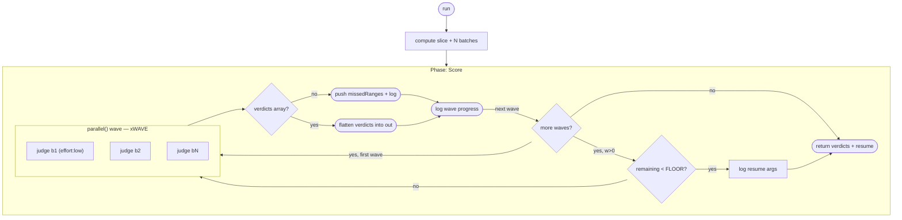

# Score every item in a large catalog (sharded, resumable, budget-aware)

**Shape:** sharded map — batched fan-out in throttled waves

## Problem

You maintain a catalog of several hundred items. Each entry has a name, a description, a URL, and assorted metadata, all sitting in one JSON file (the same setup applies to a SQLite table). You have a fixed editorial rubric: four 0–5 dimensions (accuracy, completeness, clarity, utility), an overall *fit* call that decides whether an entry deserves its place at all, and a short written assessment with pros and cons per item. You want **every single item** scored against that rubric, returned as structured, machine-readable verdicts keyed by item id — not a prose dump.

The operational constraints:

- The catalog is far too large for one agent. Hundreds of records swamp any single context window, and per-item care degrades long before the end of the list.
- Firing one agent per item all at once trips provider rate limits. Concurrency has to stay bounded regardless of how big the catalog grows.
- The run is long and may be interrupted partway — by a token budget, by rate limiting, by you. Lost work is expensive: you need to restart from any point without re-scoring what is already done.
- Silent gaps are worse than loud failures. If some items end up unscored (a worker dies, the budget runs out), you must know **exactly which ones** at the end of the run, not discover holes in the data later.
- The run may execute under a hard token budget, and blowing through it mid-flight with no accounting of coverage is unacceptable.

## Topology

The diagram below traces the actual control flow in `workflow.js`: one `Score` phase whose wave loop fans a bounded batch of judges out per iteration, checks the budget rail before each wave (after the first), and collects survivors while routing failed batches to a `missedRanges` list — no silent caps, an early exit that always prints resume args.



## Reference solution

The shape is a **sharded map**: one phase, no gates, no loops-until-convergence — just a corpus divided into fixed-size index slices and a fleet of identical judges, throttled and instrumented.

Why it fits: the work is embarrassingly parallel (items are independent) but both ends of the parallelism spectrum fail — one agent can't hold the corpus, and N agents at once hit rate limits. Slicing by *index range* rather than by payload is the key move: every judge receives the same catalog path plus a `[lo .. hi)` range, so the orchestrator never holds catalog content itself, and the prompt builder is a pure function of the batch number.

Topology walkthrough:

1. **Constants up front.** `CATALOG`, `COUNT`, and `START` come from `args`; `BATCH` (items per judge), `WAVE` (judges in flight), and `FLOOR` (budget rail threshold) are tuning constants. `N = ceil(COUNT / BATCH)` batches cover the slice `[START .. START + COUNT)`.
2. **Wave loop.** The batch indexes are walked `WAVE` at a time; each wave is one `parallel()` over `WAVE` schema'd `agent()` calls, awaited before the next wave starts. This is the throttle: concurrency is exactly `WAVE` regardless of corpus size (the engine's own semaphore is a host-wide cap, not a per-run rate-limit policy).
3. **Budget rail between waves.** Before dispatching each wave (after the first), the loop checks `budget.total && budget.remaining() < FLOOR`. If the floor is hit, it breaks — and the `log()` line states exactly how many of the `COUNT` items were NOT scored and prints the precise `{"start", "count"}` args that would finish the job.
4. **Collect with no silent caps.** Each wave's results are walked twice: once with indexes to name every failed batch and the exact `[lo .. hi)` item range it strands (pushed to `missedRanges`, logged loudly), and once through `.filter(Boolean)` to flatten the surviving `verdicts` arrays into the output.
5. **Resumable return.** The body returns `{ verdicts, scored, expected, missedRanges, stoppedEarly, resume }` — `resume` is the ready-to-paste `args` object for the next run, and `missedRanges` tells you which failed batches to re-run individually.

Resumability is entirely `args`-driven: `start`/`count` select any contiguous slice of the corpus, so an interrupted 500-item run that stopped at item 260 resumes as `{"start":260,"count":240}` with zero duplicated work.

**Two elements are deliberate additions** to the base pattern, called out here because they are rails the pattern needs rather than decoration:

- **The between-wave budget rail.** Without it, a budgeted run dies mid-wave on a budget-exhaustion throw with no account of coverage. With it, the run degrades gracefully: stop early, report the exact shortfall, hand back the resume args.
- **`effort: 'low'` on the judge agents.** Applying a fixed rubric to a ten-item slice is mechanical work; a low reasoning tier scores it just as well, and with dozens of judges in flight the effort tier is the single biggest lever on whether the budget rail ever fires.

## Techniques

- **Index-sliced sharding** — judges share one catalog path and differ only by `[lo .. hi)` range; the prompt builder `PROMPT(i)` is a pure function of the batch index.
- **Wave throttling** — `for (let w = 0; w < N; w += WAVE)` with an awaited `parallel()` per wave bounds concurrency below provider rate limits, independent of the engine semaphore.
- **`args`-driven resumability** — `start`/`count` select any contiguous slice; every early stop logs the exact resume args, and the return value carries them as `resume`.
- **Per-item verdict schema** — schema const in CAPS; each batch returns `{ verdicts: [...] }` with an enum fit tier, four integer ratings, and pros/cons per item; `additionalProperties: false` throughout.
- **`.filter(Boolean)` after `parallel()`** — failed agents resolve `null`, never throw; survivors are flattened, casualties handled separately.
- **No-silent-caps logging** — every failed batch is logged with the exact item range it strands, and `missedRanges` is returned so gaps are queryable, not discoverable.
- **Budget rail between waves** *(deliberate addition)* — `budget.total && budget.remaining() < FLOOR` stops the run while it can still report the shortfall precisely.
- **`effort: 'low'` on mechanical judges** *(deliberate addition)* — rubric application does not need a high reasoning tier; cheap judges keep the fleet inside budget.
- **`log()` narration** — wave-by-wave progress (`scored so far` against `COUNT`) so a watcher can see throughput and coverage live.

## Run it

```
ultracodex run examples/map-over-corpus/workflow.js --budget 500k \
  --args '{"catalog":"/abs/path/to/catalog.json","count":500}'
```

This does not run as-is: you must supply your own data. The `catalog` arg is required and must be an absolute path to a JSON array of `{id, name, description, url, ...}` records (the workflow defaults to the placeholder `/path/to/catalog.json`, which will not exist); `count` is how many items to score this run and `start` is the first index — omit them to score 500 items from index 0. To resume an interrupted run, paste the `{"start":...,"count":...}` object that the early-stop log printed.

Cost expectation: one judge agent per 10-item batch, so roughly `count / 10` agents (about 50 for the default 500-item run), all on the cheap `effort: 'low'` tier and throttled to `WAVE` (5) in flight at a time; the `--budget` floor stops the run between waves before it overruns, printing the resume args for the remainder.
