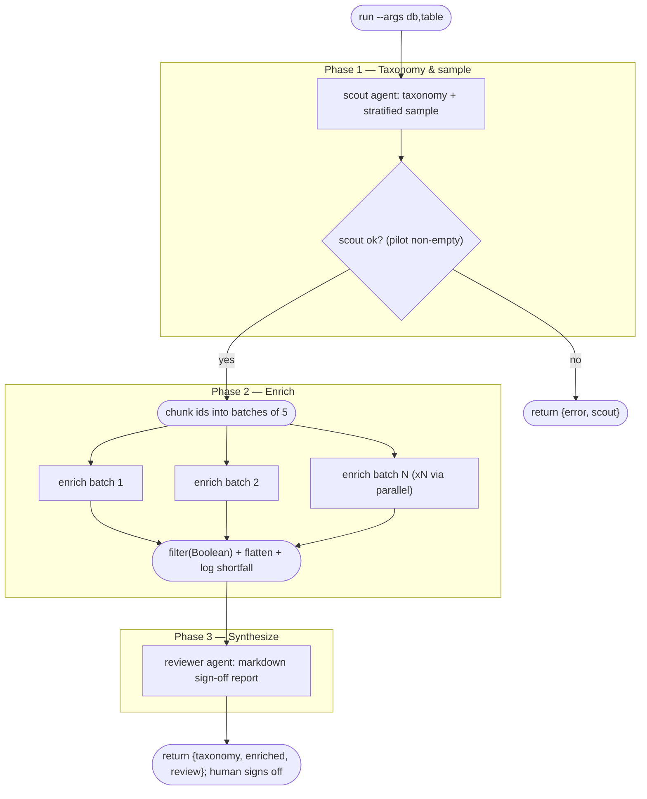

# Enrich a large dataset — pilot on a stratified sample first

**Shape:** scout → gate → chunked fan-out → synthesis sign-off

## Problem

I have a local SQLite database with a collection of several thousand records that a cheap first-pass classifier filed in, recording a confidence score per record. I want to enrich every record with new editorial fields: a category, a 0–1 editorial score, a short grounded summary (≤160 chars), the evidence supporting inclusion, and a re-check of whether the record even belongs in the collection — the cheap classifier definitely let some through that shouldn't be there.

Two things are unproven and I refuse to bet a full run on them:

- **The taxonomy doesn't exist yet.** It has to be derived from what's actually in the data, not from my intuition — if the categories are wrong, every downstream label is rework.
- **The enrichment prompt is untested.** I don't know if the summaries will come out grounded (asserting only what the record supports, never inventing details), whether the scores will be calibrated consistently across records, or whether the membership re-check catches the misfiled ones.

Constraints that matter:

- Running the whole collection costs real money and hours; a bad full run means paying twice. But I also can't eyeball thousands of records by hand — I need a small sample whose quality generalizes. It must be *representative*, not random: the popular records (where a wrong entry is most visible), the records the classifier was least confident about (where the misfiled ones hide), and ordinary mid-tier records.
- Judging membership and writing a careful summary takes real attention per record. An agent handed hundreds of records at once gets sloppy by the end; whatever does the enrichment has to look at only a handful at a time.
- The output must validate against a strict schema — fixed fields, closed enums — because it will eventually be written back into the database; free-form prose is useless to me.
- The database must be touched read-only during this trial.
- Nothing scales until **I** sign off. The deliverable of this trial isn't the enriched records — it's a report I can actually judge: does the taxonomy hold up, do the summaries sound right, what slipped through the classifier, and what decisions are still mine to make before the full run.

## Topology

The diagram below traces `workflow.js` exactly: one scout, an early-exit gate, a chunked fan-out over the pilot ids, and a single reviewer — with the run terminating at the human sign-off rather than branching into the full pass.



Note the two exits: the gate short-circuits to a structured error before any enrichment budget is spent, and the happy path stops at the reviewer's report — scaling to the full collection is a deliberate second run, not an edge in this graph.

## Reference solution

The shape is **scout → gate → chunked fan-out → synthesis sign-off**, a pilot run that deliberately ends at a human decision boundary.

**Phase 1 — Taxonomy & sample (scout).** A single agent does the work everything else depends on: it samples the database broadly (READ-ONLY, via the `sqlite3` CLI) to derive a 10–20 category taxonomy *from the data*, and picks a stratified pilot sample of a few dozen records — roughly a third popular, a third ambiguous (lowest prior-classifier confidence), a third mid-tier. Both outputs come back in one strict schema (`TAXONOMY_SCHEMA`). This must be one agent, not two: the sample should be spread across the categories the same agent just discovered.

**Gate.** Before anything fans out, an early-exit guard checks the scout result. `agent()` resolves `null` on failure rather than throwing, so `if (!scout || !scout.pilot?.length) return { error, scout }` is the whole gate — the run returns a structured error object instead of burning the enrichment budget on garbage.

**Phase 2 — Enrich (chunked fan-out).** The pilot ids are chunked into fixed-size batches (default 5 — small enough that each worker stays careful on every record) and dispatched via `parallel()`. Each worker gets the scout's taxonomy interpolated into its prompt, reads its rows read-only, and returns per-record fields against `ENRICH_SCHEMA`: a membership `verdict` (closed enum — this is the audit of the cheap classifier), `category`, `score`, a grounded `summary`, `evidence`, `confidence`, `notes`. Failed batches yield `null`; `.filter(Boolean)` drops them and a `log()` line reports exactly how many records came back versus planned — batches never disappear silently.

**Phase 3 — Synthesize (sign-off).** A reviewer agent gets the taxonomy, the pilot roster with strata, and the full enriched JSON, and writes the markdown report the human actually needs: taxonomy gaps, summary grounding and score calibration, every record whose verdict wasn't `in-scope`, category distribution per stratum, a verbatim table of example rows so the owner can judge the editorial voice directly, and the open decisions only the owner can make. The run returns `{ taxonomy, enriched, enrichedCount, review }` — everything a follow-up full run would need — and stops. Scaling to the full collection is a deliberate second run after approval, not a branch of this one.

**Packaging note.** The pilot could equally be packaged as its own saved workflow and launched from a full-run parent via the `workflow()` hook — nesting is allowed exactly one level deep, and since this script contains no `workflow()` calls itself, it would be a legal child; the child would share the parent's budget and agent-call ledger, and the parent could inspect the returned report programmatically (say, abort if too many `out-of-scope` verdicts). This example keeps the pilot inline instead, for a structural reason: the whole point of the pilot is a *human* gate, and a run can't pause to wait for a human — the natural seam is two separate runs with the sign-off between them. Splitting the pilot into a child earns its complexity only if you later automate the gate (replace the human with a threshold check inside a parent that continues into the full pass).

## Techniques

- **Scout-then-workers** — one agent derives the shared context (taxonomy + sample) that every fan-out worker depends on, before anything fans out.
- **Data-derived taxonomy** — instruct the scout to sample the real data broadly rather than categorize from intuition.
- **Stratified sampling** — popular / ambiguous / mid strata (as a closed enum), so a small pilot's quality generalizes to the full collection.
- **Early-exit guard** — null-check the scout and `return` a structured error object; downstream budget is never spent on a failed prerequisite.
- **Chunked fan-out** — fixed-size id batches mapped to thunks for `parallel()`, bounding per-agent workload so attention doesn't degrade.
- **Strict schema contracts** — schema consts in CAPS with `additionalProperties: false`, `required` everywhere, and closed enums for judgment fields.
- **Threading scout output into worker prompts** — the taxonomy is interpolated verbatim into every enrichment prompt.
- **`.filter(Boolean)` + no-silent-drops logging** — failed batches resolve `null`, get filtered, and the shortfall is narrated with exact counts.
- **Auditing the upstream classifier** — the enrichment re-confirms membership (`in-scope` / `out-of-scope` / `unsure`) instead of trusting the cheap first pass.
- **Grounded-output instruction** — summaries may assert only what the record supports; the reviewer explicitly checks this.
- **Synthesis sign-off** — the final agent converts raw JSON into a human-judgeable report, and the run ends at the approval boundary by design.
- **args-driven configuration** — database path, table name, and batch size come from `args` with generic defaults; nothing is hard-coded.

## Run it

```
ultracodex run examples/pilot-then-full/workflow.js --watch \
  --args '{"db":"/path/to/collection.db","table":"records"}'
```

This does not run as-is: it needs your own data. Point `--args` at a local SQLite database (`db`) and the table (`table`) holding the several-thousand-record collection — the placeholder path is a stub, and the scout inspects the real schema before doing anything. Optionally set `batchSize` (default 5) to tune how many records each enrichment worker handles. The database is only ever read, so it is safe to point at a live copy; `--watch` streams phase progress, and `--budget` caps spend if you want a hard ceiling on the pilot.

Cost expectation: one scout agent, one reviewer agent, and one enrichment worker per batch — with a few-dozen-record pilot at `batchSize` 5 that is roughly 8-12 agents total (Fable-class), a small fraction of what the full collection would cost, which is the entire point of piloting first.
