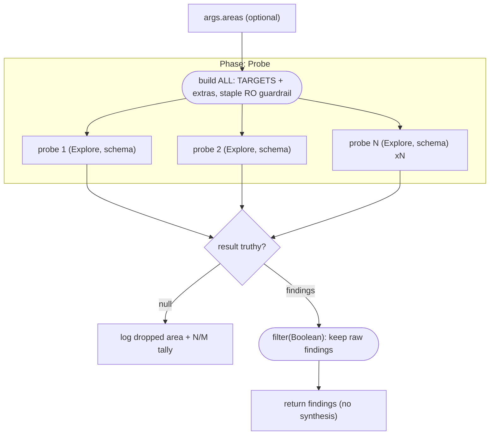

# Parallel read-only investigation with structured findings

**Shape:** single-phase parallel fan-out — independent read-only probes returning schema-validated findings, no synthesis stage.

## Problem

My machine's disk is nearly full and I can't tell what's eating it. I want a thorough investigation of every major storage area — user caches, package-manager and toolchain stores, build artifacts inside project trees, container images and VM disks, downloads, per-app support data, personal media folders, and system-level space like trash, temp, and logs — so I can decide what to reclaim.

Constraints that shape the job:

- **Nothing may be deleted, moved, or modified.** A wrong `rm` is unrecoverable, and I don't trust automated cleanup. Every command run during the investigation must be inspection-only, and that mandate has to hold for every single area with no exceptions. A human (me) reviews the findings and does all the deleting afterward.
- **Each area needs different judgment.** A package cache is disposable; a photo library is irreplaceable; an old VM disk is "it depends." A one-size-fits-all sweep will either scare me off safe wins or, worse, recommend deleting things it shouldn't. Whoever inspects each area needs area-specific guidance about what counts as regenerable there.
- **The findings must be comparable.** I want one review queue, not eight essay-style reports: for every notable space consumer, the same fields — path, size, what kind of thing it is, a safety call from a fixed scale (safe to delete / probably safe / needs my decision / do not touch), and the reason plus what regenerates it.
- **The areas are independent and each is slow to walk.** Sizing a big directory tree takes minutes; there is no ordering dependency between areas, and I don't want the total to be the sum of all of them.
- **A failure on one area must not sink the report.** If the inspection of one area errors out, I still want the findings from the other areas — just tell me which one came back empty.
- **Do not summarize away the details.** I need the raw per-area findings with exact paths and sizes, not a digest.

## Topology

The script is one phase wide and one stage deep: a plain-JS step assembles the target list, `parallel()` fans it out, and the collected results return directly — no synthesis node, no loop, no gate that can abort the run. The only branch is per-probe: a probe either yields schema-validated findings (kept) or resolves `null` (named in a log line and dropped), so a single failure costs one area rather than the whole sweep.



## Reference solution

The shape is a **flat parallel fan-out**: one probe agent per storage area, all launched at once, all read-only, each returning findings against a single shared schema. There is exactly one phase (`Probe`) and no downstream stage — the fan-out's collected results *are* the run result.

Why it fits: the areas are fully independent (no pipeline), nothing iterates to convergence (no loop), so breadth is the only axis in play — `parallel()` over the target list. Every constraint in the problem maps to one construct:

1. **`FINDINGS_SCHEMA`** (schema const in CAPS) is the comparability contract: `area` / `totalSize` / `summary` / `items[]`, where every item carries `path`, `size`, `kind`, a **`safety` enum** (`safe | likely-safe | review | keep`), and a `reason` naming what regenerates it. The enum is what turns eight independent reports into one sortable review queue.
2. **`RO`**, the shared guardrail const, encodes the read-only mandate — allowed inspection commands, forbidden destructive ones, plus efficient `du`/`find` idioms — and is interpolated verbatim into *every* probe prompt, including caller-supplied extras. One string to audit, not eight drifting copies.
3. **`TARGETS`** holds the per-area prompt tailoring: each entry shares the contract but tells its probe what dominates that area and how to rate it (caches default toward `safe`, personal media toward `review`/`keep`, VM disks split by whether they back a live VM). Paths are `~`-style placeholders; callers append their own areas via `args.areas` and the script staples the guardrail onto them.
4. The fan-out is `await parallel(ALL.map(t => () => agent(t.prompt, {...})))` with `schema: FINDINGS_SCHEMA` and **`agentType: 'Explore'`** — the upstream read-only agent profile, a second enforcement layer under the prompt-level mandate. `agentType` values are engine-defined: an engine without an `Explore` profile falls back to its default subagent, and the script runs unchanged.
5. Failure isolation comes free from the format's null semantics: a failed probe resolves `null` at its index, so `results.filter(Boolean)` keeps the rest. The script logs *which* areas dropped (`no findings from: …`) and the `N/M` tally, so nothing disappears silently.
6. **No synthesis pass, by design.** The schema already normalized the findings; a summarizer agent would only round the sizes and soften the safety calls the human reviewer needs verbatim. The script returns the raw array.

## Techniques

- **Shared guardrail constant** — one read-only mandate string interpolated into every prompt, including args-supplied ones.
- **Per-area prompt tailoring over a single contract** — same schema everywhere, area-specific judgment guidance in each prompt tail.
- **Safety-rating enum schema** — `safe | likely-safe | review | keep` makes independent findings comparable and sortable.
- **Flat `parallel()` fan-out with `.filter(Boolean)`** — one failed probe costs one area, never the run.
- **No-silent-drops logging** — `log()` names the failed areas and the returned/attempted tally.
- **No-synthesis design** — return the raw structured results; the schema is the aggregation.
- **`agentType: 'Explore'`** — engine-defined read-only agent profile as defense-in-depth; engines without it fall back to their default subagent.
- **args-extensible target list** — callers add areas without editing the script, guardrail applied automatically.

## Run it

```
ultracodex run examples/research-sweep/workflow.js --watch
```

Runs as-is with no user data: the eight `TARGETS` are baked in and use `~`-style placeholder paths, so the sweep works on any machine out of the box. The probes are strictly read-only (they run `du`/`find`/`ls`/`stat`/`df` and nothing destructive), so it is safe to point at a real home directory. To cover machine-specific locations, append your own areas without editing the script:

```
ultracodex run examples/research-sweep/workflow.js --watch --args '{"areas":[{"area":"NAS","prompt":"Investigate /mnt/nas ..."}]}'
```

Each appended area inherits the `RO` guardrail automatically. Add `--budget 500k` to cap output tokens if you extend the list far.

Cost: one Explore-class agent per area — eight by default, plus one for each area you append — all launched in a single parallel wave, with no synthesis pass on top.
