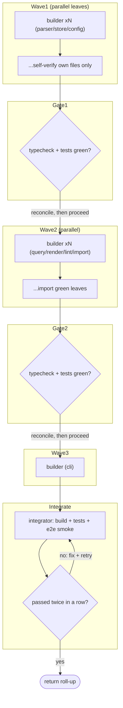

# Build a multi-module project in dependency-ordered waves with gate agents

**Shape:** dependency-ordered parallel waves → serial reconciliation gate after each wave → final convergence integrator

## Problem

I have a fully specified but unimplemented multi-module project: a structured-notes CLI in TypeScript (ESM, Node 20+, npm). The repo skeleton is already committed before any code is written: `docs/module-contracts.md` pins the exact exports, signatures, and error behavior of every module; `docs/design-notes.md` holds the rationale; `src/types.ts` holds the shared types (frozen — nobody may edit it); `package.json`/`tsconfig.json` are set up (also frozen). Eight modules remain to be implemented, each with its own test file:

- `parser`, `store`, `config` — leaves; they depend only on the shared types.
- `query`, `render`, `lint`, `import` — each imports one or more of the leaves.
- `cli` — imports everything.

Constraints that make this hard:

- **Too big for one sitting.** One agent writing all eight modules plus tests loses the plot long before the end. The contract doc was written precisely so different modules can be implemented independently against it.
- **Dependency order is real.** `query` cannot be written truthfully until `parser` and `store` exist to import and run against; `cli` needs everything.
- **A global typecheck is meaningless mid-build.** While some modules don't exist yet, the compiler drowns real errors in missing-import noise. A module's own tests are the only signal it can trust before the tree is complete (the test runner transpiles per-file, so missing siblings don't break you unless you import them).
- **Seams drift.** Independently written modules will disagree at their interfaces — error shapes, comparison semantics, option objects. When two files disagree, the contract doc — not whichever file is more convenient to change — decides which side is wrong. Blaming the wrong side "fixes" the typecheck while silently breaking the contract.
- **Test integrity.** A mismatch must never be resolved by weakening assertions or deleting tests. A test may only change if it contradicts the contract doc.
- **Uneven difficulty.** `parser` and `query` are subtle (grammar, precedence, cross-module comparison semantics); `store`/`config`/`render`/`lint`/`import` are routine. Paying top-tier model rates for everything wastes budget; using a cheap model for everything botches the hard parts.
- **File ownership must stay disjoint.** No agent may edit the shared types, the toolchain files, or files assigned to another module; nobody runs `git commit`.
- **"Done" is not "unit tests pass."** Done means: full typecheck, full build, entire test suite green, and an end-to-end smoke of the real built binary in a scratch directory — import a sample file, query it with `--json`, lint a deliberately malformed file, delete, compact, verify, with exit codes asserted — and the whole sequence has to hold up when repeated.

The project checkout location must come in as an input (`projectDir`), not be hardcoded.

## Topology

The diagram below is the actual shape of `workflow.js`: three dependency-ordered waves, each a parallel fan-out of builders, separated by single serial reconciliation gates, ending in one integrator whose "pass twice in a row" loop lives inside the agent (the back-edge). Each wave fans out to N builders (shown as 2 representative nodes with an xN label); gates and the integrator are single agents. There are no script-level branches or early exits — gates log remaining issues and the pipeline always proceeds forward.



## Reference solution

The shape is **waves × gates**: three dependency-ordered waves of builders, a serial gate agent after each parallel wave, and a final integrator that loops until the whole system is green.

Why it fits: the dependency DAG stratifies cleanly into layers (leaves → mid-tier → roof), so within a layer everything parallelizes and between layers nothing does. Builders are cheap to parallelize because the contract doc removes the need to coordinate — but only if their verification stays scoped to files they own. That scoping guarantee is exactly what creates the drift the gates exist to catch: nobody has run the full typecheck yet, so a dedicated agent must, at the first moment the tree is complete enough for the result to mean something.

Walkthrough of the topology (`workflow.js`):

1. **`Wave1`** — `parallel()` over three builders (`parser`, `store`, `config`). Every builder prompt is `COMMON` (project orientation, mandatory contract-doc reads, ownership rules, the *no-global-typecheck* rule, the structured-return contract) plus a per-module assignment block with concrete edge cases. Each call carries `schema: SUMMARY` so the fan-in is data (`files`, `testsPassed`, `deviations`, `notes`), not prose. The wave result is narrated with a per-builder green/RED roll-up via `log()`.
2. **`Gate1`** — one agent runs the full typecheck and full test suite for the first time. Its prompt encodes the arbiter rule: cross-module mismatch → fix the *caller* to match the contract; module deviated from the contract → fix the *module*; never resolve a disagreement by convenience; never weaken or delete tests; imports of future-wave files must sit behind lazy dynamic imports, not stubs. It returns `GATE_SCHEMA` (`typecheckOk`, `testsOk`, `failuresFixed`, `remainingIssues`) so the script can log what's still broken instead of silently proceeding.
3. **`Wave2`** — four parallel builders (`query`, `render`, `lint`, `importers`) that import the now-green leaves. Same `COMMON`, same `SUMMARY`, same self-verification scoping — their *own* siblings are being written concurrently, so the global-typecheck ban still holds.
4. **`Gate2`** — same gate prompt, pointed at the wave-2 seams (the query/lint shared comparison semantics are the planted drift point).
5. **`Wave3`** — a single builder for `cli`, which imports every other module; no siblings, so no `parallel()`.
6. **`Integrate`** — one agent owns convergence: typecheck + build + full suite, CLI sanity (`--help`, `lint` on a sample), then a hermetic end-to-end smoke in a temp dir driving the real `dist/cli.js`, iterating on failures **until the whole sequence passes twice in a row**. The convergence loop lives inside the agent's prompt rather than the script — the integrator has the error output in context, so it repairs far faster than re-prompting from outside would.

Model routing is done by difficulty: builder specs carry an optional `model` field (`'sonnet'` for routine modules), and the two `hard: true` modules omit it to get the engine's default (strongest) tier — the script just passes `model: b.model` through. Note that model tier names (`'sonnet'` | `'opus'` | `'haiku'` | `'fable'`) are **advisory strings**: each engine maps them onto its own configured models, preserving the relative capability/cost semantics rather than any specific model identity — which is what keeps the script portable across engines.

A note on isolation: all these builders share one working tree safely **only because file ownership is disjoint** — each prompt assigns an exact file list and forbids touching anything else, so parallel writers never collide. If assignments overlapped (two agents editing the same file, or agents that must run the full build mid-wave), the right tool would be `isolation: 'worktree'`, which gives each agent a fresh detached git worktree instead.

## Techniques

- **Dependency-ordered wave scheduling** — `parallel()` within a stratum of the module DAG, `await` as the barrier between strata.
- **Gate agent between waves** — a serial reconciler runs the checks the parallel builders were banned from running.
- **Contract-as-arbiter rule** — the gate prompt names the contract doc as the authority on which side of a cross-module mismatch is wrong.
- **No-global-typecheck-during-waves rule** — builders self-verify only their own files with per-file tests, because the shared tree is incomplete by design.
- **Model-override-by-difficulty** — per-builder advisory `model` tiers; hard modules take the engine default, routine ones a cheaper tier.
- **Structured per-builder report schemas** — CAPS schema consts (`SUMMARY`, `GATE_SCHEMA`, `INTEGRATE_SCHEMA`) turn fan-in into data with a `deviations` field for contract escapes.
- **Shared prompt preamble + assignment blocks** — one `COMMON` string carries the invariant rules; each builder appends only its own file list and edge cases.
- **Disjoint file ownership for shared-tree parallelism** — explicit per-agent file lists plus frozen shared files replace worktree isolation.
- **Null-tolerant fan-in** — `.filter(Boolean)` after `parallel()` plus `?.` on every agent result; failed builders become `RED` in the roll-up, not crashes.
- **No-silent-gaps logging** — `log()` narration after every wave and gate, including remaining-issue counts, so a partial failure is visible at the moment it happens.
- **Convergence-inside-the-agent** — the integrator's "iterate until it passes twice in a row" loop lives in its prompt, keeping repair context (error output) with the repairer.
- **Args-driven project root** — `projectDir` comes from `args` and is validated up front; nothing is hardcoded.

## Run it

```
ultracodex run examples/staged-build-gates/workflow.js --args '{"projectDir": "/abs/path/to/project"}' [--watch] [--budget ...]
```

This does NOT run as-is: the `--args` `projectDir` is required (the script throws immediately without it), and it must point at a repo checkout where the skeleton is already committed BEFORE the workflow runs — `docs/module-contracts.md` (exact exports/signatures/errors per module), `docs/design-notes.md`, `src/types.ts` (frozen shared types), and `package.json` + `tsconfig.json` (frozen toolchain). Bring your own contracted project; there is no bundled fixture. Add `--watch` to follow the phase/gate logs live and `--budget` to cap spend.

Cost expectation: 11 agents in one run — 8 builders (5 routine modules on the cheaper advisory `sonnet` tier, plus 3 on the engine-default strongest tier: the two `hard` modules `parser`/`query` and the `cli`, which carries no `model` field and so also takes the default), 2 gate agents, and 1 integrator; the integrator and gates carry the heaviest context and iterate internally, so they dominate the bill.
